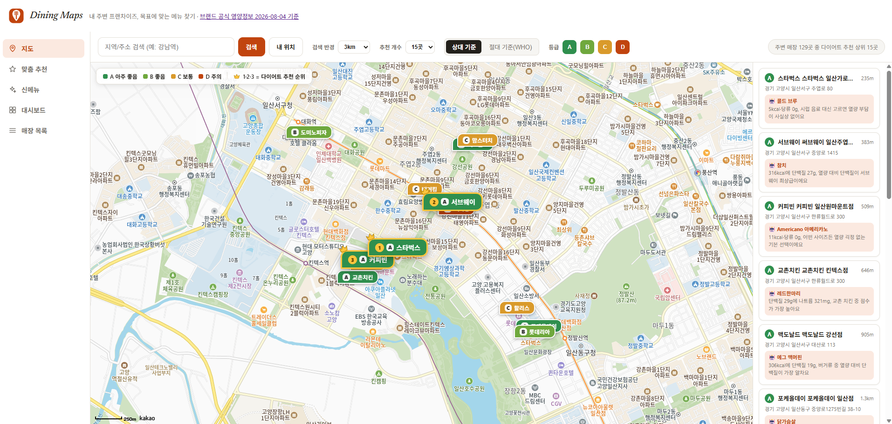
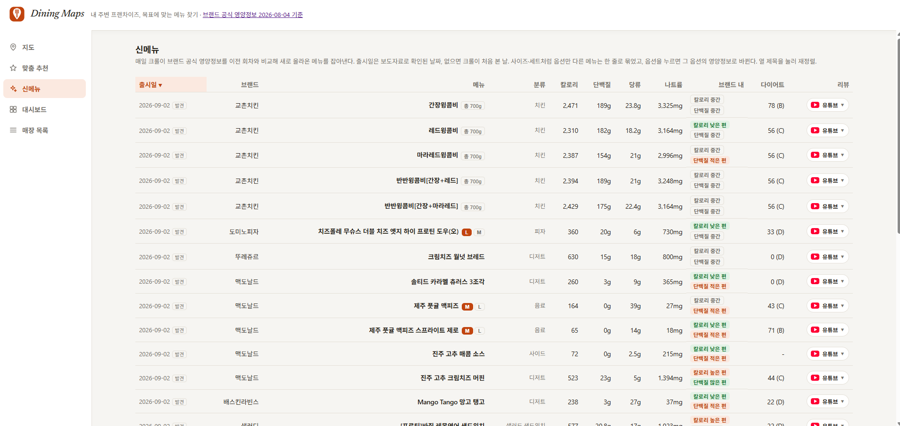
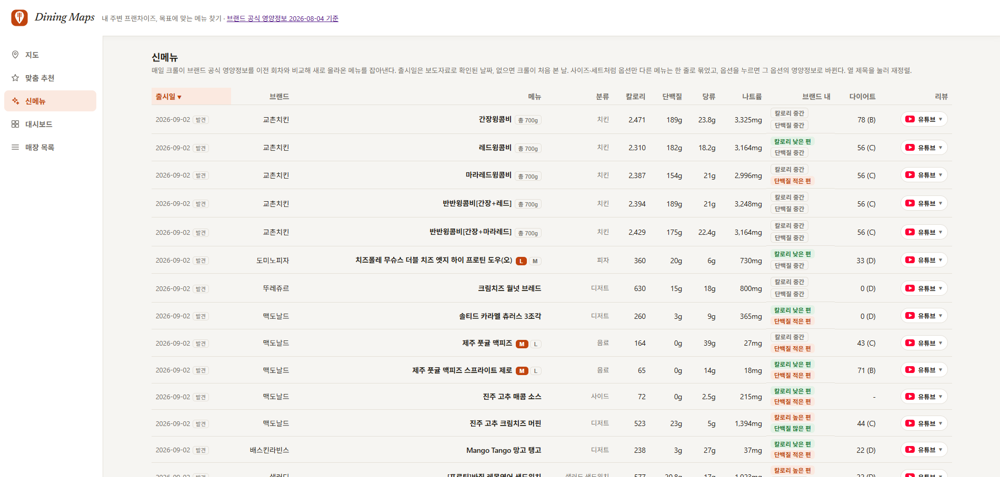
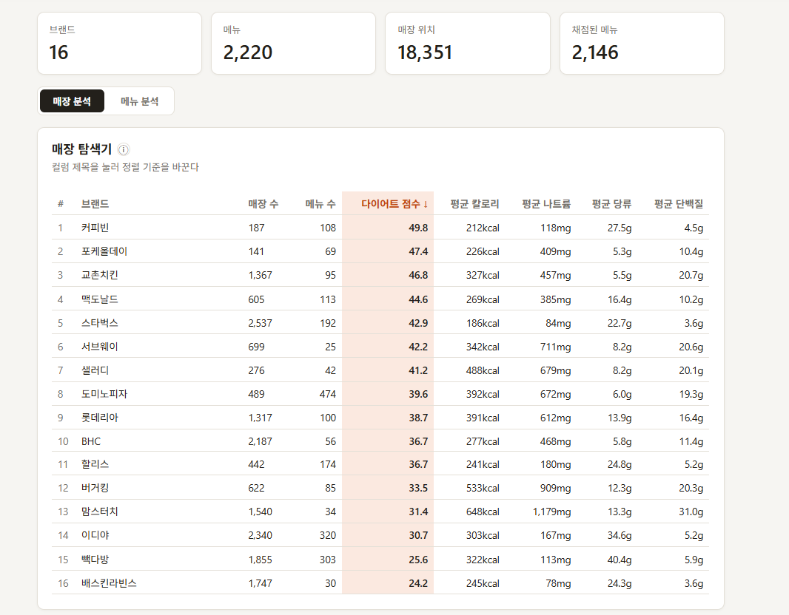
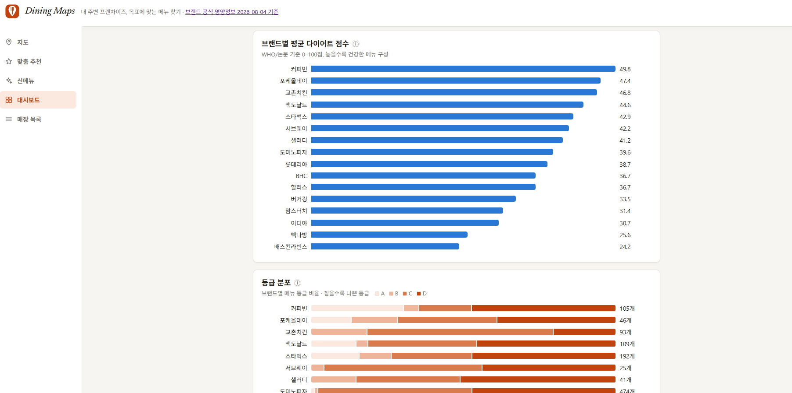
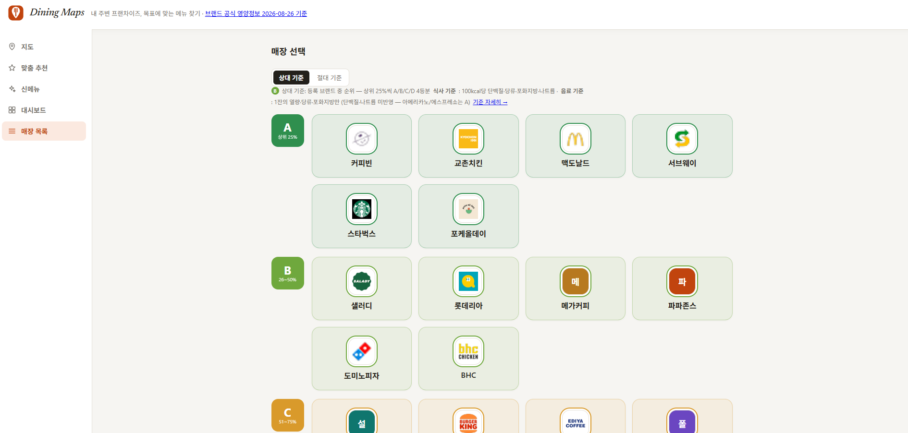
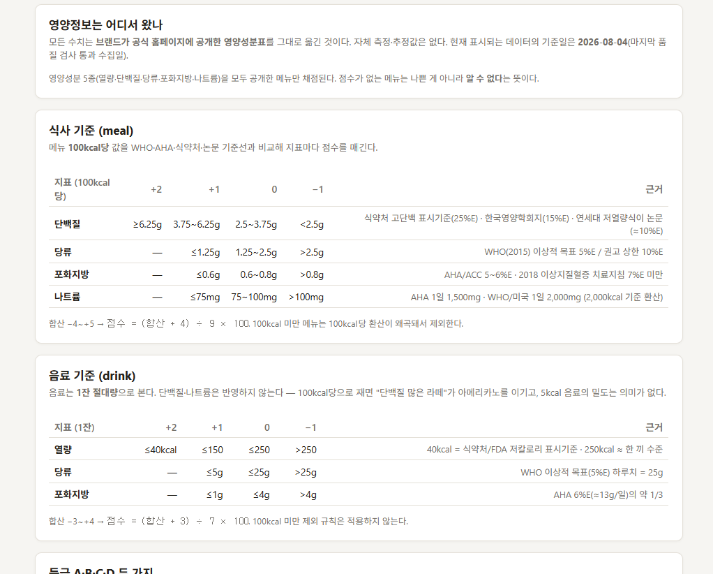

# Dining Maps

> 프랜차이즈 26곳의 공식 영양정보를 **하나의 기준으로 정규화**해 비교하고, 내 위치·목표에 맞는 메뉴를 **지도에서 바로 찾는** 웹 서비스.
> 수집 → 검증 → 적재 → 가공 → 서빙까지 직접 설계·운영한 **데이터 엔지니어링 포트폴리오**다.



| | |
|---|---|
| **Live** | https://d13coohgfeztsm.cloudfront.net/ |
| **역할** | 1인 개발 — 조사·크롤러·파이프라인·API·프론트·배포 전부 |
| **스택** | Python · FastAPI · PostgreSQL · dbt · Airflow · GitHub Actions · React · AWS Lambda/CloudFront · Neon |
| **데이터** | 브랜드 26 · 메뉴 4,469 · 영양정보 23,265행 · 매장 18,351곳 (전국) |

---

## 목차

1. [무엇을 만들었나](#1-무엇을-만들었나)
2. [왜 만들었나 — 조사로 확인한 문제](#2-왜-만들었나--조사로-확인한-문제)
3. [데이터 파이프라인](#3-데이터-파이프라인)
4. [브랜드별 수집 — 형식이 다 다르다](#4-브랜드별-수집--형식이-다-다르다)
5. [데이터를 어떻게 다뤘나](#5-데이터를-어떻게-다뤘나)
6. [설계 결정과 그 이유](#6-설계-결정과-그-이유)
7. [운영 — 자동화와 배포](#7-운영--자동화와-배포)
8. [실행](#8-실행)
9. [문서](#9-문서)
10. [알려진 한계 · 다음 작업](#10-알려진-한계--다음-작업)

---

## 1. 무엇을 만들었나

### 지도 — 내 주변에서 뭘 먹을지

반경 안 매장을 다이어트 등급(A~D) 마커로 뿌리고, 브랜드마다 **추천 메뉴 한 줄 이유**를 카드로 붙인다. 이유 문장은 런타임 LLM 호출이 아니라 재채점 때 미리 생성해 둔 캐시(`brand_menu_reco`)다.

### 맞춤 추천 — 목표 하나만 고르면

로그인 없이 목표(다이어트 / 근성장 / 저나트륨)와 한 끼 상한만 고른다. 신체정보를 넣으면 Mifflin-St Jeor로 하루 필요 열량을 계산해 3끼로 나눈 값이 상한이 된다. 각 메뉴엔 **가장 가까운 매장과 거리**가 붙는다.



### 신메뉴 — 크롤 diff에서 나오는 피드

매 크롤이 직전 회차와 비교해 새로 등장한 메뉴를 잡아낸다. 출시일은 보도자료로 확인한 날짜가 우선, 없으면 크롤이 처음 본 날. 옵션(사이즈·세트)은 한 줄로 묶고, 유튜브 리뷰를 인라인으로 연다.



### 대시보드 — 브랜드를 숫자로

브랜드별 매장 수·메뉴 수·평균 영양소·다이어트 점수·등급 분포. 서빙은 dbt가 재계산하는 `mart_*` 테이블에서 읽는다 — OLTP 테이블을 staging 뷰 → dim/fact 스타 스키마 → rollup 순으로 변환하고 `dbt test`로 계약을 검사한다.




### 매장 목록 — 브랜드를 등급으로

브랜드를 상대 등급(카탈로그 내 상위 25%씩 A/B/C/D)으로 묶어 보여준다. 기준 설명 페이지에서 **모든 임계값의 출처**(WHO·AHA·식약처·논문)를 공개한다.




---

## 2. 왜 만들었나 — 조사로 확인한 문제

외식할 때 주변 메뉴의 영양정보가 브랜드별로 흩어져 있고 형식도 제각각이라 같은 기준으로 비교하기 어렵다. 이건 추정이 아니라 **46개 브랜드를 직접 조사**([brand_survey.md](docs/brand_survey.md))하며 확인한 사실이다.

- **공개하는 영양소 항목이 다르다** — 대부분 5종(열량·단백질·당류·포화지방·나트륨), 샐러디 7종, 포케올데이 9종
- **공개 형식이 다르다** — 공식 JSON API는 4곳뿐. 나머지는 정적 HTML / AJAX / 인라인 JS / 사이트맵 / **이미지로만 공개**
- **세트 메뉴는 칼로리 "범위"만 준다** — 고정값이 없어 비교가 성립하지 않는다 → 채점에서 의도적으로 제외
- **기준 단위가 다르다** — 1인분 / 100g / 용기 전체(도미노 1.5L 스프라이트 660kcal)

이 조사 결과가 이후 모든 설계(스키마·자동화 수준·크롤러 구조·채점 기준)의 근거가 됐다.

---

## 3. 데이터 파이프라인

```
 [수집 Extract]        [검증 Validate]         [적재 Load]        [가공 Transform]         [서빙 Serve]
 crawl_*.py       →    snapshot_and_      →    load_data.py  →    compute_diet_score   →   FastAPI (Lambda)
 브랜드별 파서 26개       validate.py              UPSERT             + rescore_if_changed      + React + 카카오맵
 → data/<brand>.csv     스냅샷 · 룰 검사          CSV → Postgres     + generate_menu_reco      mart_* 뷰에서 읽음
                        · diff 판정               (게이트 실패 시 스킵)  + fetch_youtube_reviews
                        fail → exit 1                                + dbt run / dbt test (mart)

 GitHub Actions: 크롤 주 2회 (월·목 02:00 KST) → CSV 커밋 / 검증·적재·재채점 매일 03:00 KST
 Airflow DAG 2개(nutrition_pipeline 매월, store_location_pipeline 매주)는 로컬 Docker에서 동일 흐름을 오케스트레이션
```

| 단계 | 스크립트 | 하는 일 |
|---|---|---|
| 수집 | `scripts/crawl/crawl_*.py`, `crawl_common.py` | 브랜드별 파서. 출력은 표준 13컬럼 CSV 하나로 통일 |
| 검증 | `scripts/pipeline/snapshot_and_validate.py` | 스냅샷 저장 → 4개 룰 검사 → 직전 회차와 diff → "파서 버그 vs 실제 변경" 판정. **fail이면 exit 1** |
| 적재 | `scripts/pipeline/load_data.py` | `menu_item` / `nutrition_fact` UPSERT. `conn.pipeline()`으로 왕복 최소화 |
| 가공 | `compute_diet_score.py`, `rescore_if_changed.py`, `dbt/models/` | 100kcal 기준 채점, 절대·상대 등급, 지문(fingerprint) 비교로 변경 시에만 재채점. 대시보드용 마트는 dbt(staging → dim/fact → rollup)가 재계산 |
| 보강 | `scripts/llm/generate_menu_reco.py`, `scripts/crawl/fetch_youtube_reviews.py` | 브랜드별 추천 한 줄(Claude, structured output), 신메뉴 유튜브 ID |
| 매장 | `scripts/pipeline/fetch_store_locations_nationwide.py` | 카카오 로컬 API를 25km 격자로 전국 순회, 45건 상한에 걸리면 재귀 4분할 |

---

## 4. 브랜드별 수집 — 형식이 다 다르다

공개 형식이 브랜드마다 다르다. 26곳을 뜯어보니 **공식 JSON API는 4곳뿐**이고 나머지는 HTML을 파싱하거나, 아예 사람이 옮겨 적어야 했다.

| 브랜드 | 제공 형식 | 진입점 | 가공에서 걸린 지점 |
|---|---|---|---|
| 맥도날드 | 공식 JSON API | `/api/v1/kor/product/nutrition` | 영양정보가 `"중량;275,열량;520,..."` 한 문자열 — `;`·`,`로 두 번 쪼갠다. 세트·해피밀 조합은 고정값이 없어 제외 |
| BHC | 자체 JSON API 3단 | `/api/v1/web/categories→products→{code}` | 맛(후라이드/양념)별로 행 분리. 중량이 `"10호(951g~1,050g)"` 산문이라 버리고 `per_100g` 표기 |
| 스타벅스 | 정적 JSON 파일 | `/upload/json/menu/{code}.js` × 10 | `_L`(Large) 쌍둥이 레코드는 무시 — Tall 기준으로 통일 |
| 버거킹 | 사내 RPC (JSON) | `POST /burgerking/BKR0347.json` | **WAF가 TLS를 끊어 자동화 불가.** 브라우저 콘솔로 받아 커밋. 단백질이 `"2146(107)"`(값+%DV)이라 괄호 앞만 취함 |
| 롯데리아 | 정적 HTML 표 1장 | `lotteeatz.com/.../ria/items.html` | rowspan 복원 대신 `num,num,금액,금액` 패턴으로 데이터 블록 위치를 탐지. 칼로리를 `~`범위로 주는 세트 행은 스킵 |
| 도미노피자 | 정적 HTML, 표 17개 | `/contents/ingredient` (**euc-kr**) | 피자명 `rowspan=19`라 격자 복원 필수. 헤더가 중복돼 **컬럼 인덱스 고정**. 도우·소스·치즈 표는 성분 분해라 제외(이중 계산) |
| 할리스 | 숨은 HTML 패널 | `/menu/{espresso,tea,...}.do` | 제품명이 `th`가 아니라 `<caption>`. HOT/ICED를 별도 행으로 분리 |
| 커피빈 | 페이지네이션 HTML | `/menu/list.asp?page=&category=` | `dt`가 값, `dd`가 라벨로 **뒤집혀** 있음 |
| 빽다방 | 호버 패널 HTML | `/menu/menu_{coffee,drink,dessert}/` | `<table>`이 아니라 스타일링된 `<ul>`이라 범용 표 파서가 놓침. 베스트메뉴 슬라이더와 중복돼 이름 기준 dedup |
| 이디야 | AJAX 더보기 | `/inc/ajax_brand.php?gubun=menu_more` | **GET이면 조용히 1페이지만 반복** — 빈 body로 POST 강제. `520ml`은 `weight_g`로 넣지 않음 |
| 메가커피 | 목록 HTML(페이징) | `/menu/menu.php?page=&menu_category1=` | HOT/ICE 라벨을 이름에 붙여 분리, `(이름, kcal)` 키로 dedup |
| 컴포즈커피 | XE CMS 갤러리 | `?act=dispCafemenuGalleryList` → `...Item` | 새 `item_srl`이 안 나오면 종료 (마지막 페이지 신호 없음) |
| 폴바셋 | 목록→상세 (JS 링크) | `List.pb?cid1=` → `View.pb?dpid=` | `onclick="goView('PB…')"`에서 ID 추출 |
| 교촌치킨 | **PC HTML + 모바일 JSON 조인** | `menu/view.asp` + `POST getProductListToMenu.do` | 모바일 API엔 당류·포화지방이 없고 PC엔 가격이 없다 → 상품 ID로 조인. 일부는 `per_100g` |
| 서브웨이 | 목록→상세 HTML | `/menuList/sandwich` → `/menuView/...` | `data-menuitemidx`를 긁어 ID 발견(하드코딩 X). GitHub Actions IP는 403 → 로컬 수집 |
| 샐러디 | 목록→상세 HTML | `/menu/list_1` → `/menu/view_1?idx=` | 26곳 중 **유일하게 탄수화물·지방까지** 공개 (7종) |
| 포케올데이 | HTML 안 인라인 JS 배열 | `/nutrition_info` | `itemInfoArr`를 정규식으로 꺼내 `원재료용량\|열량\|...` 10필드 파이프 문자열 분해. **9종으로 최다** |
| 배스킨라빈스 | 목록→상세 HTML | `/menu/list.php?category=` → `view.php?seq=` | `dl` 영양표는 아이스크림 카테고리에만 존재 |
| 설빙 | 목록→상세 HTML | `/menu/?type=설빙` → `menu_view.php?menu=` | 영양정보가 표가 아니라 안내문 텍스트 — 정규식으로 라벨:숫자 추출 |
| 에그드랍 | 목록→상세 HTML | `/menu/list.php?category=` → `view.php?seq=` | 표마다 `구분` 컬럼 유무가 달라 헤더를 **오른쪽 정렬**해 맞춤. 인증서 체인 불완전 → SSL 폴백 |
| 파리바게뜨 | **XML 사이트맵** | `/product-sitemap.xml` → 전 상품 URL | 목록 페이지가 없어 사이트맵으로 URL을 얻는다. 상세는 산문이라 `칼로리(kcal) : 250` 정규식 |
| 뚜레쥬르 | 목록→상세 ASP | `/product/list.asp?ref=` (**euc-kr**) | utf-8로 읽으면 조용히 깨진다. 이름은 `og:title`에서 |
| 미스터피자 | 정적 HTML 표 | `/sh_page/menuinfo.php?type=2` | `열량(kcal)` 헤더를 가진 표만 선별 후 격자 복원 |
| 파파존스 | **수기 캡처 TSV** | 모달 캡처 → `data/papajohns_nutrition_raw.tsv` | 사이즈(R/L/F/P)로 시작하는 행은 위 제품명을 승계 |
| 한솥도시락 | 수기 인덱스 + HTML 상세 | 목록 API 403 → TSV 인덱스, 상세는 `/menu/menu_view/{idx}` | **칼로리·가격만** 공개하는 부분 확보 브랜드 |
| 맘스터치 | **이미지(PNG)로만 공개** | — | 파서 불가. 수기 입력 후 검증(`data_source=image_ocr_manual_verify`), 세트는 칼로리 범위만 별도 컬럼 |

### 공통으로 묶은 것

브랜드마다 파서는 다르지만 **입출력 규약은 하나**다 — `scripts/crawl/crawl_common.py`.

- `fetch()` — urllib 한 겹. 데스크톱/모바일 UA, POST 자동 전환, 인증서 체인이 깨진 사이트(에그드랍 등)는 **SSL 검증 없이 1회 재시도**, euc-kr 사이트는 호출부가 인코딩을 지정한다.
- `match_nutrient()` — 라벨→컬럼 매핑을 **긴 라벨 우선**으로 본다(`포화지방산`을 `지방`보다 먼저). 위치가 아니라 라벨로 읽으니 컬럼 순서가 바뀌어도 살아남는다.
- `num()` — `"0.5g 미만"`→`0.5`, `"5 (10%)"`→`5`. 단 `-`·`미표기`는 **0이 아니라 빈 값** (미공개와 0은 다르다).
- `nutrition_basis` — 단위 환산 대신 기준을 라벨로 남긴다(`per_serving` / `per_100g`(BHC·교촌) / `per_total`(도미노)). 등급은 칼로리로 나눠 계산해 스케일이 상쇄되지만, 화면에 그대로 뿌리는 원값은 기준을 알아야 한다.
- `write_csv()` — 표준 13컬럼으로 `data/<brand>.csv` 출력. **0행이면 예외를 던진다** — 파서가 깨졌을 때 멀쩡한 CSV를 빈 파일로 덮어쓰지 않으려고.

여기서 나온 CSV가 그대로 품질 게이트(`snapshot_and_validate.py`) → 적재(`load_data.py`)로 들어간다. 영양소는 고정 컬럼이 아니라 `nutrition_fact` 행으로 풀어 저장한다.

---

## 5. 데이터를 어떻게 다뤘나

### 스키마 — 영양소는 컬럼이 아니라 행

```sql
restaurant(id, name)
menu_item(id, restaurant_id, name, category, category_group, price_krw, weight_g,
          nutrition_basis, data_source, released_at, image_url, youtube_video_id)
nutrition_fact(menu_item_id, nutrient_name, value, unit)     -- 메뉴 × 영양소 = 1행 (EAV)
diet_score(menu_item_id, score, absolute_grade, relative_grade, percentile)
store(kakao_place_id UNIQUE, restaurant_id, branch_name, lat, lng, last_seen_at)

-- 이력·품질 (append-only, 절대 UPDATE 하지 않음)
crawl_run · menu_snapshot · nutrition_snapshot · data_quality_check · menu_change_log

-- 대시보드용 마트 (dbt가 매 실행마다 재계산: stg_* → dim_*/fact_* → mart_*)
mart_brand_nutrition · mart_nutrient_trend · mart_data_quality
```

브랜드마다 공개 항목이 달라 고정 컬럼으로 만들면 대부분 브랜드에서 `carb_g`가 영구 NULL이 된다. 그래서 `nutrition_fact(nutrient_name, value, unit)`로 풀어 저장하고, 서빙 테이블(UPSERT)과 이력 테이블(append-only)을 분리했다. 이력이 있어야 "매달 다시 긁는" 행위에 의미가 생긴다 — diff가 신메뉴 피드와 품질 판정의 원천이다.

### 품질 게이트 — 적재 "전"에, 하드 블로커로

`load_data.py`가 UPSERT라서 파서가 조용히 깨지면 **나쁜 데이터가 정상 데이터를 덮어쓰고 에러도 안 난다.** 실제로 두 번 겪었다 — 롯데리아 컬럼 밀림, 100kcal 미만 밀도 왜곡으로 아메리카노 전부 A등급. 그래서 크롤과 적재 사이에 게이트를 두고, 실패하면 적재를 스킵해 기존 데이터를 살린다.

| 검사 | 기준 | 심각도 |
|---|---|---|
| `brand_has_rows` | 브랜드 CSV가 0행 | fail |
| `row_count_stability` | 직전 회차 대비 행 수 50% 초과 감소 / 20% 초과 감소 | fail / warn |
| `nutrient_coverage` | 직전에 80% 이상 채워지던 영양소가 50% 미만으로 | fail |
| `value_range` | 열량 0~5,000kcal, 나트륨 0~20,000mg 등 물리적 상한 | warn |

Airflow에선 `retries=0`이다. 품질 실패는 flake가 아니라 신호라서 재시도로 거짓 통과시키지 않는다.

### "파서 버그 vs 실제 메뉴 변경" 판정

> 한 브랜드 항목의 **30% 초과가 동시에 같은 필드에서** 움직이면 파서 버그로 본다. (항목 5개 이상일 때만 적용)

브랜드는 메뉴를 몇 개씩 리뉴얼하지, 하룻밤에 전 메뉴 나트륨을 바꾸지 않는다. 반대로 파서가 깨지면 그 브랜드 **모든** 항목이 같은 방식으로 틀어진다. 검증을 위해 단백질↔나트륨 컬럼을 일부러 뒤바꿔 돌렸더니 변경 188건이 **전부** `suspected_parser_bug`로 분류되고 적재가 차단됐다 ([data_quality.md](docs/data_quality.md)).

### 채점 — 100kcal 기준, 문헌 인용 임계값

100g이 아니라 **100kcal당**으로 정규화한다. 샐러디가 중량을 공개하지 않아서다 — 한 브랜드라도 정규화가 불가능하면 공정 비교가 깨지므로, 모든 브랜드가 가진 칼로리를 분모로 썼다.

| 지표 (100kcal당) | 좋음 (+2) | 나쁨 (−1) | 근거 |
|---|---|---|---|
| 단백질 | ≥6.25g | <2.5g | 식약처 고단백 표시기준 25%E · 한국영양학회지 15%E · 저열량식 논문 10%E |
| 당류 | ≤1.25g | >2.5g | WHO(2015) 이상적 목표 5%E / 권고 상한 10%E |
| 포화지방 | ≤0.6g | >0.8g | AHA/ACC 5~6%E · 이상지질혈증 치료지침 7%E |
| 나트륨 | ≤75mg | >100mg | AHA 1일 1,500mg · WHO 2,000mg (2,000kcal 환산) |

세 번 갈아엎었다. v1 백분위 → 평균이 항상 50 근처로 수렴해 전 브랜드 C. v2 자체 추정 절대값("225kcal/100g") → 근거가 약함. **v3 문헌 인용 절대값**이 현재고, v4에서 음료를 분리했다 — 음료를 100kcal당으로 재면 "단백질 많은 라떼"가 아메리카노를 이기고 5kcal 음료의 밀도는 의미가 없어서, 음료는 1잔 절대량으로 본다. 100kcal 미만 메뉴는 채점하지 않는다.

**등급은 절대·상대 이중.** 절대 기준(WHO)은 근거가 명확하지만 패스트푸드 특성상 대부분 D로 몰린다. 상대 기준(카탈로그 내 상위 25%씩 A/B/C/D)은 UX에 맞지만 근거가 약하다. 그래서 **점수는 절대 기준 그대로 두고 등급 밴드만 상대화**해 둘 다 저장한다.

### 재채점은 데이터가 바뀌었을 때만

`rescore_if_changed.py`가 Postgres `md5()`로 전체 `menu_item` + `nutrition_fact`의 지문을 만들고, **`compute_diet_score.py` 파일 자체의 md5도 섞는다.** 데이터가 그대로여도 채점 규칙이 바뀌면 재채점된다. 지문이 바뀌면 채점 → LLM 추천 문구 → 유튜브 조회가 순서대로 돈다.

### LLM은 캐시로만, 환각은 스키마로 막는다

브랜드별 "추천 메뉴 + 한 줄 이유"는 Claude structured output으로 생성해 `brand_menu_reco`에 저장한다. 런타임엔 LLM 호출이 없다. **응답 스키마의 `menu_name`을 그 브랜드 실제 메뉴명 enum으로 강제**해 없는 메뉴가 나올 수 없고, DB의 `menu_item_id` FK가 이중 안전장치다. 후보는 브랜드당 점수 상위 40개만 넘긴다.

### 매장 위치 — 카카오 API의 45건 상한을 넘는 법

카카오 로컬 검색은 키워드당 최대 45건(15 × 3페이지)만 준다. 전국 2,500개 스타벅스를 한 번에 얻을 수 없어서:

1. 남한을 **25km 격자 364개**로 나눠 브랜드별로 순회
2. 한 격자가 45건에 걸리면 **재귀적으로 4분할** (반경 1km까지)
3. 브랜드명 매칭은 substring이 아니라 **prefix** — `"또봉이통닭 대전교촌점"`이 교촌으로 잡히지 않게. 별칭(`써브웨이`, `베스킨라빈스`)은 테이블로
4. 절단 여부는 `is_end`가 아니라 `total_count > pageable_count`로 판단 — 카카오는 774건이 있어도 45건에서 `is_end=True`를 준다
5. `kakao_place_id` UNIQUE로 dedup, `last_seen_at`으로 14일 이상 안 보인 매장을 플래그(삭제는 안 함)

---

## 6. 설계 결정과 그 이유

**미공개와 0을 구분한다** — `-`·`미표기`·`해당없음`은 빈 값이지 0이 아니다. 결측을 0으로 보면 저칼로리로 오인돼 추천 1등에 올라오는 사고가 난다. 추천은 필요한 영양소가 빠진 메뉴를 제외한다.

**단위를 환산하지 않고 기준을 라벨로 남긴다** — `nutrition_basis`(`per_serving` / `per_100g` / `per_total`). 등급은 칼로리로 나눠 계산하니 스케일이 상쇄되지만, 화면에 그대로 뿌리는 원값은 기준을 알아야 한다. 음료의 용기 전체 기준은 식약처 1회 섭취참고량(200ml)으로 맞춘다.

**라벨로 읽지, 위치로 읽지 않는다** — `match_nutrient()`가 헤더 텍스트로 컬럼을 찾는다. 사이트가 컬럼 순서를 바꿔도 살아남는다. 헤더가 중복돼 어쩔 수 없이 인덱스를 고정한 도미노·파파존스는 게이트의 `nutrient_coverage`와 30% 룰이 마지막 방어선이다.

**0행이면 예외** — `write_csv()`는 빈 결과를 쓰지 않는다. 파서가 깨졌을 때 멀쩡한 CSV를 빈 파일로 덮어쓰는 게 최악의 실패 모드라서.

**Airflow가 과한 것 아니냐** — 타당한 지적이었다. 답은 **이력 추적을 붙여서 재크롤에 의미를 부여한 것**이다. 스냅샷을 쌓고 변화를 감지·판정하니 "매달 다시 긁는" 행위에 목적이 생긴다. 실제 운영은 GitHub Actions cron이 맡고, Airflow DAG는 같은 흐름을 로컬에서 재현·디버깅하는 용도다.

**엔드포인트 안에서 쿼리 횟수를 줄인다** — Lambda(시드니)와 Neon(싱가포르)의 왕복이 ~90ms라 N+1이 그대로 지연이 된다. 메뉴 API의 N+1을 제거했고, 적재는 `conn.pipeline()`, 스냅샷은 `executemany` 2회로 묶었다 (행마다 `RETURNING`하던 초기 버전은 Neon 상대로 1시간이 걸렸다).

**React로 분리한 이유** — 바닐라 JS 1,009줄이 한 파일에 있었고, 브라우저 캐시 때문에 `?v=3→4→5`를 수동으로 올려야 했다. 빌드 도구가 해시 파일명으로 해결하는 문제라 Vite로 옮겼다.

---

## 7. 운영 — 자동화와 배포

### 자동화

| 워크플로 | 주기 | 하는 일 |
|---|---|---|
| `crawl.yml` | 월·목 02:00 KST | 22개 브랜드 재크롤 → `data/*.csv` 커밋 → 브랜드별 행 수를 Step Summary에 → **실패 브랜드가 있으면 커밋 후 exit 1** (알림이 커밋 뒤에 오도록) |
| `rescore.yml` | 매일 03:00 KST | 품질 게이트 → 적재 → 지문 비교 재채점 |
| `deploy.yml` | master push | 변경된 쪽(API / 프론트)만 배포 |
| 실패 알림 | — | 카카오톡 "나에게 보내기" ([kakao_notify_setup.md](docs/kakao_notify_setup.md)) |

자동화 밖에 있는 4곳 — 버거킹(WAF가 TLS 차단, 브라우저 리플레이), 맘스터치(이미지만 공개, 수기), 서브웨이·컴포즈커피(Actions 해외 IP에 403, 로컬 크롤). 파파존스·한솥은 수기 캡처 파일을 파싱하므로 자동 갱신되지 않는다.

### 배포 — Always Free 구성

```
브라우저 → CloudFront(S3 정적) → Lambda Function URL(FastAPI + Mangum) → Neon PostgreSQL
              AWS 시드니                 AWS 시드니                          싱가포르
```

| 계층 | 구성 | 비용 |
|---|---|---|
| 프론트 | S3(비공개) + CloudFront(OAC). `/brand/*/` 디렉터리 URL은 CloudFront Function이 `index.html`로 매핑 | CloudFront 1TB/월 영구 무료 |
| API | Lambda + Function URL (API Gateway 없음) | 월 100만 요청 영구 무료 |
| DB | Neon PostgreSQL | 무료 |

- 리전은 `ap-southeast-2` 고정 — 계정 SCP가 이 리전만 허용한다
- RDS 대신 Neon — 무료 크레딧이 끝나면 db.t4g.micro 기준 월 $13~15
- Function URL 응답 상한 6MB — 파라미터 없는 `/api/stores`(전국 18k건)는 실패하지만 프론트는 항상 반경을 넘긴다
- 새 도메인은 카카오 개발자 콘솔 → Web 사이트 도메인에 등록해야 지도가 뜬다
- 로컬 `vite build`는 Node 24 + rolldown 조합에서 크래시해 스크립트가 `npx node@22`로 빌드한다

---

## 8. 실행

```bash
# DB
cd docker && docker compose up -d postgres-app                    # localhost:5432
python scripts/pipeline/load_data.py                              # data/*.csv 적재 (크롤링 없이 바로 실행 가능)

# 백엔드
pip install -r requirements.txt
python -m uvicorn app.main:app --reload                           # localhost:8000

# 프론트엔드
cd frontend-react && npm install && npm run dev                   # localhost:5173

# 데이터 마트 (선택) — dbt/README.md의 DBT_PG_* 환경변수 필요
cd dbt && dbt run && dbt test

# Airflow (선택)
cd docker && docker compose up airflow-init && docker compose up -d   # localhost:8080

# 크롤 (선택)
python scripts/crawl/crawl_viable_brands.py --list
python scripts/crawl/crawl_new_brands.py megacoffee
```

**환경변수** — `.env.example`을 복사해 채운다.

| 파일 | 변수 |
|---|---|
| `frontend-react/.env` | `VITE_KAKAO_JS_KEY`, `VITE_API_BASE` |
| `docker/.env` | `KAKAO_REST_API_KEY`, `AIRFLOW__API_AUTH__JWT_SECRET` |
| (파이프라인) | `DATABASE_URL`, `ANTHROPIC_API_KEY`(없으면 LLM 단계는 조용히 스킵) |

배포는 `scripts/deploy/deploy_lambda.sh` → 출력된 Function URL을 `scripts/deploy/deploy_frontend.sh`에 넘긴다.

---

## 9. 문서

| 문서 | 내용 |
|---|---|
| [PROJECT_CONTEXT.md](docs/PROJECT_CONTEXT.md) | 전체 맥락 요약 (설계 결정과 그 이유) |
| [diet_score.md](docs/diet_score.md) | 등급 산정 근거·수식·한계 (v1→v4 변천사) |
| [data_quality.md](docs/data_quality.md) | 품질 검증 룰과 파서버그 판정 휴리스틱, 188건 테스트 |
| [brand_survey.md](docs/brand_survey.md) | 46개 브랜드 조사 방법론과 결과 |
| [crawl_handoff.md](docs/crawl_handoff.md) | 브랜드별 크롤링 인수인계 메모 (제외 사유 포함) |
| [price_data_options.md](docs/price_data_options.md) | 가격 데이터 확보 방안 조사 및 결론 |
| [ga4_report.md](docs/ga4_report.md) | 30일 사용자 행동 리포트 |
| [dbt/README.md](dbt/README.md) | 데이터 마트 모델 구조(staging → dim/fact → rollup)와 실행법 |
| [docker/README.md](docker/README.md) | Airflow 실행법, 2.x→3.x 아키텍처 차이 |

---

## 10. 알려진 한계 · 다음 작업

**한계**

- 등급 임계값은 문헌 인용이지만 밴드 경계는 경험적 추정이라 운영 데이터로 재조정이 필요하다
- 나트륨 기준이 다른 지표보다 가혹해 여러 브랜드가 마이너스 점수를 받는다
- 세트 메뉴는 전면 제외 (고정 영양값이 없음)
- 매장 위치는 카카오맵 기준이라 폐업 미삭제·중복 등록이 섞여 있을 수 있다
- 수기 의존 브랜드 3곳(버거킹·맘스터치·파파존스)은 갱신이 사람 손에 달려 있다
- 사용자 행동 로그(GA4)는 붙였지만 **표본이 30일 8명**이라 KPI로 쓰기엔 이르다

**다음**

1. ~~확보 가능한 브랜드 크롤러 구현~~ → 26개 브랜드
2. ~~클라우드 배포~~ → CloudFront + Lambda + Neon
3. ~~사용자 행동 로그~~ → GA4 커스텀 이벤트 수집 중, 표본 확보가 남음
4. 버거킹 WAF 우회 없이 갱신할 방법 — 현재는 수기 리플레이 (2026-08-12 고정)
5. 가격 데이터 — 소비자원 참가격·KOSIS 연동 ([price_data_options.md](docs/price_data_options.md))
